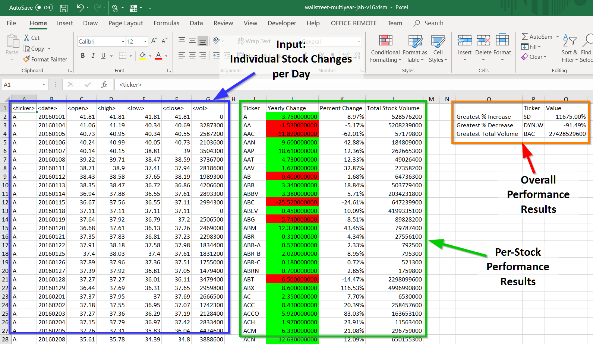

# StockReports

This application generates stock performance reports
based upon stock data provided as input.

# Technologies Used

* Microsoft Excel Visual Basic for Applications (VBA)

# My Contributions - Jeff Brown

* I designed and implemented all code for this application
* Data for this application was supplied by others

# Summary

See the Figure 1 below. 
This applications uses information on per-stock day-to-day price and volume changes to generates a performance report that includes:

* Per-Stock Performance Results
* Overall Performance Results

| Figure 1: StockReports - Input Data and Results |
|----------|
|  |

# Design

| Figure 2: StockReports - Design |
|----------|
|  |

