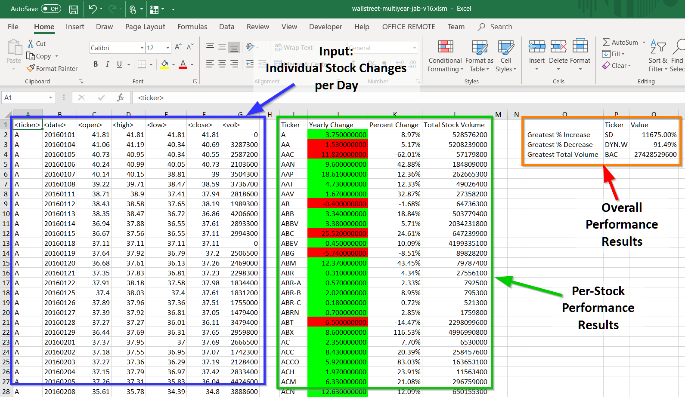
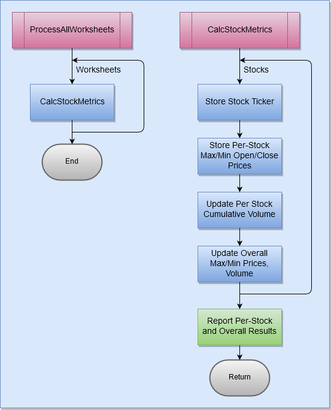

# Stock Reports

This application generates stock performance reports
based upon stock data provided as input.

# Technologies Used

* Microsoft Excel Visual Basic for Applications (VBA)

# Source Code

* GitHub: https://github.com/daddyjab/StockReports

# Contributions

* Jeffery Brown: Designed and implemented all code for this application.
* Data:
    * Stock price/volume data was supplied as an input

# Summary

See the Figure 1 below. 
This application uses information on per-stock day-to-day price and volume changes to generate a performance report that includes:

* Per-Stock Performance Results
* Overall Performance Results

| Figure 1: Stock Reports - Input Data and Results |
|----------|
|  |

# Design

Figure 2 below shows the general design/flow of the application code.

* The main function `ProcessAllWorksheets` loops through each worksheet in the workbook that contains Stock data.
* The function `CalcStockMetrics` loops through each stock in the list of stock data, uses the `FindTickerIndex` function to manage a list of unique stock tickers for the output table, and tallies needed max/min and volume information.  This loop also updates the overall results table information.  Finally, the function uses functions `PopCalcTableHeader` and `PopCalcTableRow` to create the per-stock and overall results tables on the worksheet being processed.

| Figure 2: Stock Reports - Design |
|----------|
|  |

